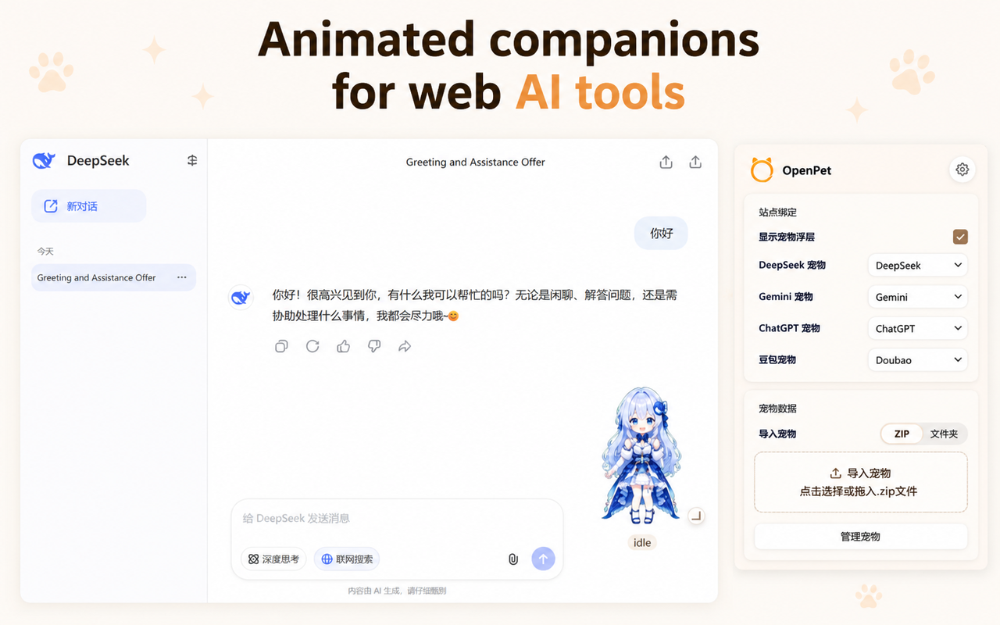

#  OpenPet: Animated companions for web AI tools

[](README.zh-CN.md)
[](README.md)
[](LICENSE)



OpenPet is a browser extension that brings animated companions to supported AI chat sites, manages per-site bindings, and helps you jump back to the right conversation tab with one click.
It is designed to stay local-first, with pet assets, bindings, and UI preferences stored in the browser for long-term use and multi-site management.

## Quick Navigation

- [Core Capabilities](#core-capabilities)
- [Installation](#installation)
- [Usage Flow](#usage-flow)
- [Supported Sites](#supported-sites)
- [Browser Compatibility](#browser-compatibility)
- [Pets](#pets)
- [Permissions](#permissions)
- [Privacy](#privacy)
- [Repository Layout](#repository-layout)
- [License](#license)

## Core Capabilities

- Show animated companions on supported AI chat sites
- Import pet packages from local `.zip` files or folders
- Built-in official pets on first install
- Multiple pets with per-site bindings
- Supports `DeepSeek`, `Doubao`, `ChatGPT`, and `Gemini`
- Pet assets, site bindings, and UI preferences stay in the browser

## Installation

Choose the channel that fits your workflow:

| Install link | Best for |
| --- | --- |
| [GitHub Releases](https://github.com/AwesomeHou/OpenPet/releases) | Latest release packages, offline installs, archived versions |
| Chrome Web Store | Coming soon |
| [Edge Add-ons](https://microsoftedge.microsoft.com/addons/detail/openpet/coknmkebdekgpiianinblcaldibfnepk) | One-click install for Edge users |

If you install from GitHub Releases, download the release package and load the unpacked extension directory in your browser. If you install from a store, just click install.

## Usage Flow

1. Install OpenPet and pin the extension entry in your browser.
2. Open a supported AI chat site such as DeepSeek, Doubao, ChatGPT, or Gemini.
3. Import a pet package in the extension, or use the official pets included on first install.
4. Bind a pet to a site and adjust your site configuration in the pet management view.
5. Return to the conversation page and the companion will appear in supported pages based on site state.

## Supported Sites

- DeepSeek: `https://chat.deepseek.com/`
- Doubao: `https://www.doubao.com/`
- ChatGPT: `https://chatgpt.com/`
- Gemini: `https://gemini.google.com/`

## Browser Compatibility

OpenPet is built with Chrome Extension Manifest V3, so it can run in these desktop browsers:

- Chrome
- Edge
- Other Chromium-based browsers that support extensions

If the browser supports unpacked extensions and Manifest V3, it can usually load this project's `dist/` output.

## Pets

### Get Pets

OpenPet already includes official pets on first install. If you delete them later, you can find them again in [`AwesomeHou/openpet-ai-girls`](https://github.com/AwesomeHou/openpet-ai-girls).

### Pet Format

OpenPet uses a pet package format compatible with Codex pets. A pet usually contains two parts:

- `pet.json`: pet metadata, including `id`, `displayName`, `description`, and `spritesheetPath`
- `spritesheet.webp`: the pet animation atlas. In this document, OpenPet treats it as a Codex pet style action atlas with 9 rows (`0~8`) for `idle`, `running-right`, `running-left`, `waving`, `jumping`, `failed`, `waiting`, `running`, and `review`

In practice, a pet package imported into OpenPet is just a local pet resource package containing the files above.

### How to Make Pets

If you want to create OpenPet pets yourself, the recommended path is the Codex `hatch-pet` skill:

1. Prepare a character concept, brand cue, or reference image.
2. Use the `hatch-pet` skill to generate the base pet and animation frames.
3. Check animation consistency with the skill's built-in validation and contact sheet.
4. Export `pet.json` and `spritesheet.webp`.
5. Import the pet package into OpenPet and use it on supported sites.

If you already have pet assets from another source, you can also organize them into the `pet.json + spritesheet.webp` structure and import them.

## Permissions

OpenPet currently requests:

- `storage`: local pets, bindings, settings, and cached state
- `unlimitedStorage`: reduce the chance of local quota failures when importing larger assets
- `tabs`: focus the correct chat tab when the pet is clicked
- host access on supported chat pages: detect page state and render the overlay

These permissions are only used for the extension workflow and do not mean OpenPet uploads your chat content to its own servers.

## Privacy

OpenPet is built to keep data local.

- It does not require a cloud account.
- It does not require sending chat content to OpenPet servers.
- Pet assets, bindings, and UI preferences are stored locally in the browser.

For more detail, see [`README.zh-CN.md`](README.zh-CN.md) and [`scratch/openpet-privacy-policy.en.md`](scratch/openpet-privacy-policy.en.md).

## Repository Layout

```txt
openpet/
  assets/                      # repository-level brand and shared image assets
    brand/                     # brand assets such as logos and banners
    icons/                     # icon assets
    screenshots/               # release and README screenshots
  apps/                        # application entry points
    chrome-extension/          # browser extension source
  packages/                    # shared logic and pet asset tooling
  scripts/                     # build and helper scripts
  dist/                        # build output loaded by the browser
  scratch/                     # release copy, drafts, and planning notes
  README.md                    # English documentation
  README.zh-CN.md              # Simplified Chinese documentation
  LICENSE                      # license file
```

## License

MIT
