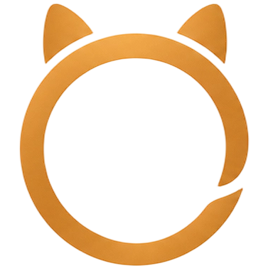

# OpenPet

[](README.zh-CN.md)
[](README.md)
[](LICENSE)

<p align="center">
  
</p>

<p align="center">
  <strong>面向网页 AI 工具的动画伙伴</strong>
</p>

<p align="center">
  OpenPet 是一个浏览器扩展，用于在支持的 AI 聊天站点中展示动画伙伴、管理站点绑定，并帮助你快速回到当前会话标签页。
</p>

<p align="center">
  本地优先 · 无云账号 · 首装预装官方宠物 · 支持多宠物与多站点绑定
</p>

## 快速导航

- [特性](#特性)
- [快速开始](#快速开始)
- [支持站点](#支持站点)
- [浏览器兼容](#浏览器兼容)
- [宠物格式](#宠物格式)
- [如何制作宠物](#如何制作宠物)
- [发布渠道](#发布渠道)
- [权限说明](#权限说明)
- [隐私](#隐私)
- [项目结构](#项目结构)
- [进一步了解](#进一步了解)
- [许可证](#许可证)

## 特性

- 本地优先运行，不依赖云账号
- 支持从本地 `.zip` 文件或文件夹导入宠物包
- 首次安装会自动预装官方宠物
- 支持多宠物管理与按站点绑定
- 支持 `deepseek`、`doubao`、`chatgpt`、`gemini`
- 宠物资产、绑定和界面偏好都保存在浏览器本地

## 快速开始

1. 安装依赖：

```bash
npm install
```

2. 构建扩展：

```bash
npm run build
```

3. 在 Chrome 或 Edge 中加载 `dist/` 目录作为未打包扩展。

## 支持站点

- DeepSeek: `https://chat.deepseek.com/`
- Doubao: `https://www.doubao.com/`
- ChatGPT: `https://chatgpt.com/`
- Gemini: `https://gemini.google.com/`

## 浏览器兼容

OpenPet 基于 Chrome 扩展 Manifest V3 开发，因此可以在以下桌面浏览器中使用：

- Chrome
- Edge
- 其他兼容 Chromium 扩展的浏览器

如果浏览器支持安装未打包扩展，并兼容 Manifest V3，通常也可以加载这个项目的 `dist/` 产物。

## 宠物格式

OpenPet 使用与 Codex pets 兼容的宠物包格式。一个宠物通常包含两部分：

- `pet.json`：宠物元数据，包含 `id`、`displayName`、`description` 和 `spritesheetPath`
- `spritesheet.webp`：宠物动画精灵图

你导入到 OpenPet 的宠物包，本质上就是一个包含上述文件的本地宠物资源包。

## 如何制作宠物

如果你想自己制作 OpenPet 宠物，推荐使用 Codex 的 `hatch-pet` 技能：

1. 准备角色设定、品牌线索或参考图。
2. 使用 `hatch-pet` 技能生成基础宠物和各动作帧。
3. 通过技能自带的校验与联系表检查动画一致性。
4. 导出得到 `pet.json` 和 `spritesheet.webp`。
5. 将宠物包导入 OpenPet，即可在支持站点中使用。

如果你已有其他来源的宠物资产，也可以整理成 `pet.json + spritesheet.webp` 的结构再导入。

## 为什么值得安装

- 你可以在常用的 AI 会话页面上看到一个持续存在的宠物浮层
- 你可以给不同站点绑定不同宠物，避免所有页面都长得一样
- 你可以直接导入自己的宠物资产，而不是只能使用内置内容
- 你可以在首次安装时直接看到官方预装宠物，不必先完成导入

## 发布渠道

OpenPet 计划通过以下渠道发布：

- GitHub Releases
- Chrome Web Store
- Edge Add-ons

这三个渠道会尽量保持同一套版本号、同一套构建产物和同一套说明文案。

## 权限说明

OpenPet 当前请求以下权限：

- `storage`：用于保存宠物、绑定、设置和缓存状态
- `unlimitedStorage`：用于降低导入较大宠物资源时触发本地配额失败的概率
- `tabs`：用于点击宠物后聚焦到正确的会话标签页
- 受支持站点的页面访问权限：用于检测页面状态并渲染浮层

这些权限只用于扩展本体的本地工作流，不意味着 OpenPet 会把你的聊天内容上传到它自己的服务端。

## 隐私

OpenPet 以本地存储为优先。

- 不需要云账号
- 不需要把聊天内容发送到 OpenPet 服务端
- 宠物资产、绑定和界面偏好都保存在浏览器本地

正式隐私政策分为两版：

- 中文版：[`scratch/openpet-privacy-policy.zh-CN.md`](scratch/openpet-privacy-policy.zh-CN.md)
- 英文版：[`scratch/openpet-privacy-policy.en.md`](scratch/openpet-privacy-policy.en.md)

如果某个平台只允许提交一个隐私链接，建议使用一个中英双语的正式隐私页。

## 项目结构

```txt
openpet/
  assets/
    brand/
    icons/
  apps/
    chrome-extension/
  packages/
  scripts/
  dist/
  scratch/
  README.md
  README.zh-CN.md
  LICENSE
```

- `assets/` - 仓库级品牌与共享图片资源
- `apps/chrome-extension/` - 扩展源码
- `packages/` - 共享逻辑与宠物资源工具
- `scripts/` - 构建与辅助脚本
- `dist/` - 浏览器实际加载的构建产物
- `scratch/` - 发布文案、说明草稿和规划记录

## 进一步了解

- 英文版文档：[`README.md`](README.md)
- 中文隐私政策草稿：[`scratch/openpet-privacy-policy.zh-CN.md`](scratch/openpet-privacy-policy.zh-CN.md)
- 英文隐私政策草稿：[`scratch/openpet-privacy-policy.en.md`](scratch/openpet-privacy-policy.en.md)
- 发布与上架资料：[`scratch/openpet-store-and-release-pack.md`](scratch/openpet-store-and-release-pack.md)

## 许可证

MIT
